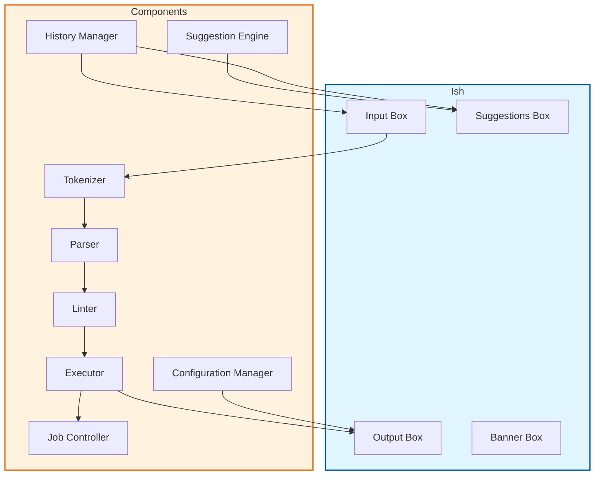

# Table of Contents

1. [Overview](#overview)
2. [Features](#features)
3. [Strcuture](#structure)
4. [Installation](#installation)
5. [License](#license)

---

## Overview

**Ish** or *Intelli-Shell* is a cross platform system shell with a built in intellisense that suggests what
the next possible command is. The purpose of the shell is to make the command-line
experience of the user as convenient as possible while making it aesthetically pleasing.

Developed in *Rust* using *Ratatui*. It's a hobbyist system shell that ultimately prioritizes
the experience of the user.

> ***Info:***
> This shell is still under development by a single developer.
> Expect a few bugs while using it.

---

## Features

**Ish** has lots of features that offers to the user:

- `Piping`: ':' pipes the stdout of the previous process to the stdin of the next process.

- `Redirection`: "to" or "from" redirects the stdout,stderr or stdin of the previous process to the next process.

- `Continous Execution`: instead of a ';' we use the literal word: "then".

- `Parallel Execution`: instead of a '&' we use the literal word: "while".

- `Operational Execution`: instead of a '&&' or '||' we use the literal words: "and then" and "or else" respectively.

- `Jobs` : instead of the typical & at the end for background processes, we use the literal word "job" at the end: `./myprog.exe job`.

- `History` : A persistent disk backed history, accessible with arrow up/down. Stored at `./local/history.txt`.

- `Command Execution` : For executing commands the shell will use what ever tools/commands and user installed pacakages/apps is available in the OS. Linux: /usr/bin, MacOS: /bin, Windows: {Find *WSL* Path then /usr/bin, if *WSL* is not installed then we use PowerShell and use their cmdlets and properly pipe Objects}

- `Suggestions` : *Suggestions* is a TUI card that pops up above the *input box* anchored at the bottom of the screen. It suggests the likely commands you are typing, you can scroll with up/down to navigate the suggestions and right arrow to accept the suggestion. Not just commands it will also suggest files and directories when entering arguments of a command, it will also suggest environmental variables when entering with a suffix '$'.

- `Input Box`: Unlike traditional unix like shells, the *input box* is a static TUI box anchored at the bottom of the screen, which is where all input occurs. When a process with its own input is launched the stdin of **Ish** is redirected to the process until the process is over which is redirected back to **Ish**.
Processes with screen buffers will takeover the screen as rightfully so.

- `Job Control` : As with every shell this provides a way to control the jobs running in the background. You can bring them to the foreground with "fg", background with "bg" and kill with "kill" and many more tools to achieve sophisticated job management.

- `Scripting Environment` : For scripting the **Ish** interpreter will have variables, arrays, if elif and else, nesting, loops (for,while and foreach) and functions. With the `.ish` extension, *.ish* script files /can be executed directly `./myscript.ish` as long as the syntax passes the *Linter*.

- `Startup Script` : A proper shell should have its own start-up script, which obviously is named `.ishrc`.
which holds the startup configuration of **Ish**.

- `Configuration Commands` : These are special built in commands only available to **Ish**:
  - `:Color <flags: --inputbox,--output,--banner,> <color: Name or Hexadecimal Value>` changes the color of the **Ish** GUI.
  - `:Toggle <flags: --autocd (true/false),--suggestions (true/false)>` toggles *Auto-Suggest* with the prefix '[' and suffix ']', its **on** by default. toggles *Suggestions* on or off its on by default.
  The configs are then saved in the `.ishrc` file and will be applied on the next run of **Ish**.
  - `:Editor <editor name>` sets the default text editor to be used for automatic editing of text files with the prefix '/'.

---

## Structure

The structure of the **Ish** interpreter is as follows:

---

## Installation

Make sure you have the following:

- *Rust*
- *Make*

After acquiring the required packages. simply do `make install` then wait for it to successfully install.
After installing you can simply run: `ish`.

---

## License

**Ish** is under *GNU GPL v3.0 License*, for more information See [LICENSE](LICENSE).
