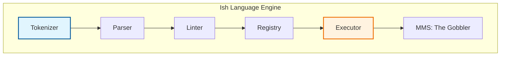

<h1 align="center"> Ish Programming Language </h1>

## Table of Contents
1. [Overview](#overview)
2. [Features](#features)
3. [Structure](#structure)
4. [Installation](#installation)
5. [Documentations](#documentations)
6. [License](#license)

---

## Overview

**Ish** (Inter-Shell) is a cross-platform, natively compiled Object-Oriented Programming (OOP) language built in *Rust*. What started as a hobbyist shell has evolved into a fully-fledged, strongly-typed programming language that prioritizes a seamless development experience.

> ***Info:***
> This language is still under active development by a single and stressed out developer.
> Expect a few bugs while using it.

---

## Features

**Ish** brings a robust, modern feature set for developers:

- **Object-Oriented Architecture**: Ish scripts are structurally organized using `namespace`, `class`, and `struct`, including constructors and destructors (`func ClassName(...)` / `func ~ClassName()`).
- **Inheritance & Static Methods**: Natively supports deep class inheritance (`class Dog : Animal`) and static execution chains.
- **Strict Typing & Generics**: Supports built-in Generics (`List<T>`) for strongly-typed instantiation, plus `enum` types.
- **Characters & Mutable Strings**: A dedicated `char` type (single-quoted literals like `'a'`) and string instance methods, including in-place mutation via `.Append()`, `.AppendTo()`, and `.Clear()`.
- **Robust Syntax**: Implements clean language constructs, strict parenthesis `()` enforcement, a ternary operator (`cond ? a : b`), `try`/`catch` error handling, and natively evaluates complex math dynamically without string hacks.
- **Advanced Control Flow**: Supports nested `if/elif/else`, `switch/case` statements, and iterative loops (`for`, `while`, `foreach`).
- **Memory Management**: Includes a fully automatic Memory Management System (MMS) called **The Gobbler** which utilizes rigorous Mark-and-Sweep algorithms to safely unallocate memory without manual intervention.
- **Location-Aware Linter**: Includes an advanced Linter that will pinpoint exactly which line and column a syntax error occurred on, making script debugging entirely seamless.
- **Program Entry Point**: Enforces strict execution architecture by requiring every `.ish` script to contain a `public static class Program { public static func Main(params string[] args) { ... } }` entry point. Note the capital `Main` and the required `params string[] args` signature — the interpreter rejects any other entry point shape.

---

## Structure

The architecture of the **Ish** execution pipeline is highly modularized into core language components:



---

## Installation

Make sure you have the following requirements installed:
- *Rust*
- *Make*

After cloning the repository, simply execute:
```bash
make install
```
Then wait for the language binaries to build and install successfully. 

### Execution
After installing, you can execute `.ish` scripts natively by running:
```bash
ish myscript.ish
```

### Uninstall

To uninstall **Ish**, simply do `make uninstall`. This will securely remove the binaries from your system.

---

## Documentations

For more details on writing Ish scripts, checking out the robust OOP capabilities, and learning about standard libraries, see the [docs](/docs/) folder:
- [Ish Programming Language Guide](/docs/ish_scripting_guide.md)
- [Standard Libraries](/docs/Standard_libs.md)

---

## License

**Ish** is under *GNU GPL v3.0 License*, for more information see [LICENSE](LICENSE).
